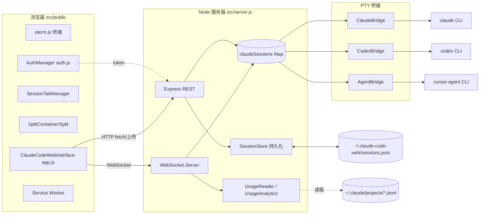
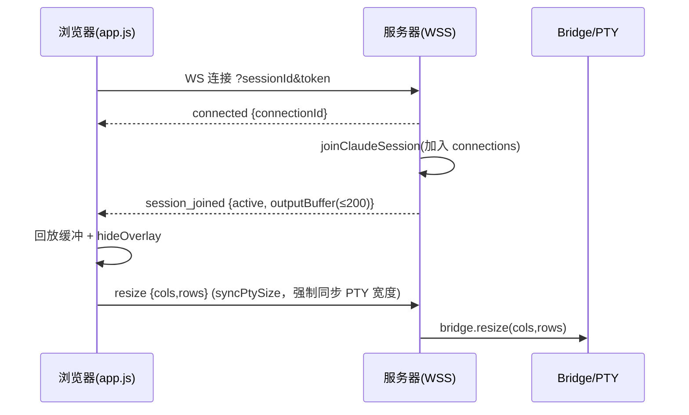
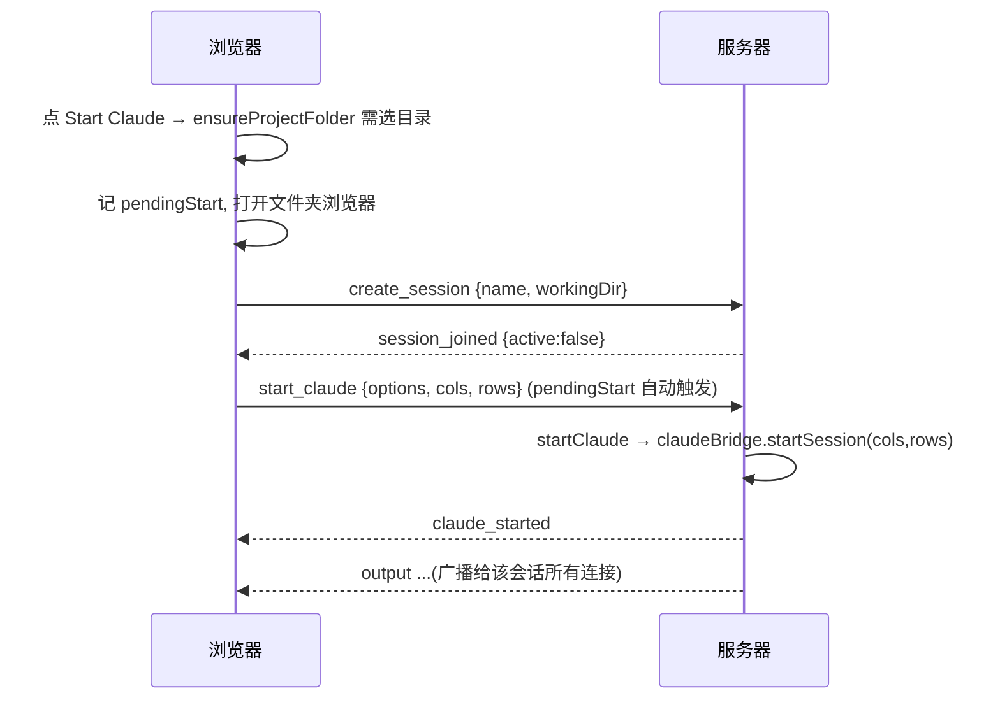

# Claude Code Web — 详细设计文档

> 版本对应：`package.json` v3.4.0。本文基于当前源码逐文件梳理，标注了 `文件:行` 以便追溯。
> 面向开发者/维护者，描述系统架构、模块职责、通信协议、数据流与已知技术债。

---

## 1. 概述

**Claude Code Web** 是 Claude Code CLI（以及 Codex、Cursor Agent）的**浏览器终端前端**。它在服务端用伪终端（PTY）拉起 CLI 进程，把输出通过 WebSocket 实时推给浏览器里的 xterm.js 终端，并把用户输入回送给 PTY。核心价值：

- **远程/多设备访问**：任意浏览器（含手机）连接同一台机器上的 CLI 会话。
- **多会话 + 持久化**：会话在服务器重启后仍可恢复；同一会话可被多个浏览器同时连接，输出镜像广播。
- **多 CLI 支持**：Claude / Codex / Cursor Agent 三选一，通过别名系统统一展示。
- **PWA**：可安装、离线壳缓存、移动端适配。

一句话架构：**浏览器 (xterm) ⇄ WebSocket/HTTP ⇄ Node 服务器 ⇄ node-pty ⇄ CLI 进程**。

---

## 2. 技术栈

| 层 | 技术 |
|---|---|
| 运行时 | Node.js ≥ 16（CommonJS） |
| HTTP/REST | `express` ^4.19 |
| 实时通信 | `ws` ^8.18（WebSocket） |
| 伪终端 | `node-pty` ^1.0 |
| CLI 解析 | `commander` ^12 |
| 公网隧道 | `@ngrok/ngrok` ^1.4 |
| 其它 | `cors`、`uuid`、`open` |
| 前端终端 | xterm.js 5.3 + addon-fit + addon-web-links（CDN 引入） |
| 前端 | 原生 JS（无框架、无构建），Service Worker PWA |
| 测试 | `mocha` + Node `assert` |

无 lint/formatter；约定见 `AGENTS.md`：2 空格缩进、分号、单引号、kebab-case 模块名、PascalCase 类、camelCase 函数。

---

## 3. 系统架构



**关键设计点：**
- 服务器是 CLI 与浏览器之间的**有状态代理**。真正的进程活在 `node-pty` 里，服务器只持有会话元数据 + 输出缓冲。
- **一个会话（session）** 可绑定 **0 或 1 个活动 PTY**（`active`/`agent` 字段）与 **N 个 WebSocket 连接**（`connections` 集合）。输出向该集合内所有连接广播 → 多设备镜像。
- PTY 进程**不随会话持久化**；重启后会话元数据恢复，但需重新 “Start Claude” 拉起进程。

---

## 4. 目录结构

```
bin/cc-web.js            CLI 入口：解析 flag、生成 token、启动服务器、ngrok
src/
  server.js              Express + WebSocket 服务器、路由、会话编排（~1415 行）
  claude-bridge.js       Claude CLI 的 PTY 管理
  codex-bridge.js        Codex CLI 的 PTY 管理
  agent-bridge.js        Cursor Agent 的 PTY 管理
  usage-reader.js        读取 ~/.claude 转录日志，算 token/成本
  usage-analytics.js     用量的内存分析层（燃烧率、套餐额度、预测）
  utils/
    session-store.js      会话磁盘持久化（sessions.json）
    auth.js               AuthManager 工具类（当前未被 server.js 使用，见 §6.8）
  public/                 浏览器资源（服务器静态托管）
    index.html            单页外壳
    app.js                主控制器 ClaudeCodeWebInterface（~2407 行）
    session-manager.js    会话标签栏 SessionTabManager
    splits.js             VS Code 风格双分屏 Split/SplitContainer
    auth.js               客户端 AuthManager
    plan-detector.js      检测 Claude plan 模式
    icons.js              内联 SVG 图标
    manifest.json         PWA manifest
    service-worker.js     PWA 离线壳缓存
    style.css             样式
test/                    Mocha 单测（bridge / server-alias / session-store）
docs/                    GitHub Pages 营销站点（与本设计文档无关）
```

---

## 5. 后端设计

### 5.1 服务器引导与生命周期

主类 `ClaudeCodeWebServer`（`server.js:17`）。构造函数（`server.js:18-59`）关键字段：

| 字段 | 含义 |
|---|---|
| `port` | 监听端口，默认 `32352`（`server.js:19`） |
| `auth` / `noAuth` | 鉴权 token / 是否关闭鉴权 |
| `folderMode` | 是否强制先选工作目录，默认 true |
| `baseFolder` | `process.cwd()`，**所有路径校验的沙箱根**（`server.js:28`） |
| `sessionDurationHours` | 用量“会话窗口”时长，默认 5h（`server.js:30`） |
| `claudeSessions` | `Map<sessionId, session>`，持久会话表（`server.js:33`） |
| `webSocketConnections` | `Map<wsId, wsInfo>`，每个 WS 连接的信息（`server.js:34`） |
| `claudeBridge`/`codexBridge`/`agentBridge` | 三个 PTY 桥（`server.js:35-37`） |
| `sessionStore` | 磁盘持久化 |
| `usageReader`/`usageAnalytics` | 用量统计 |
| `aliases` | UI 展示名 `{claude:'Claude', codex:'Codex', agent:'Cursor'}` |

构造末尾调用 `setupExpress()` → `loadPersistedSessions()` → `setupAutoSave()`（`server.js:56-58`）。

- **自动保存**：`setInterval(saveSessionsToDisk, 30000)`，并挂 `SIGINT/SIGTERM → handleShutdown`、`beforeExit → 保存`（`server.js:73-83`）。仅当 `claudeSessions.size > 0` 才写盘。
- **启动 `start()`**（`server.js:611-652`）：按 `useHttps` 建 `https`/`http` server；创建 `WebSocket.Server({ server, verifyClient })`，`verifyClient` 校验 URL query 的 `?token=`；`connection` 事件进入 `handleWebSocketConnection`。
- **ngrok 不在 server.js 内**，在 `bin/cc-web.js`（见 §9）。

### 5.2 会话模型

会话对象存于 `claudeSessions`。**有两条创建路径，字段略有差异：**

- HTTP 路径 `/api/sessions/create`（`server.js:303-314`）：
  `{ id, name, created, lastActivity, active:false, agent:null, workingDir, connections:Set, outputBuffer:[], maxBufferSize:1000 }`
- WS 路径 `createAndJoinSession`（`server.js:852-871`）：额外含 `sessionStartTime:null`、`sessionUsage:{...}`，但初始不带 `agent`。

字段语义：

| 字段 | 说明 |
|---|---|
| `active` | 是否有 PTY 正在运行 |
| `agent` | `'claude'\|'codex'\|'agent'\|null`，当前活动 PTY 属于哪个桥 |
| `connections` | `Set<wsId>`，当前连接到本会话的所有 WS |
| `outputBuffer` | PTY 输出滚动缓冲，内存上限 **1000** 条（`server.js:980-983`） |
| `workingDir` | 校验过的绝对工作目录，PTY 在此 cwd 启动 |
| `sessionUsage` | 单会话 token/成本累计（仅 WS 路径初始化） |

**多连接镜像**：`joinClaudeSession` 把 wsId 加入 `session.connections`（`server.js:907`）；`broadcastToSession`（`server.js:1233-1246`）遍历该集合向所有 OPEN 的连接推送 `output`/`exit`/`*_started`。**断开连接不杀 PTY**——即使 `connections.size===0`，会话与进程仍存活（`server.js:1259-1262`）。

> ⚠️ 注意：Claude 的 `onExit` 只把 `active=false`，**未清 `agent`**（`server.js:991-1001`）；Codex/Agent 的 exit 会同时清 `agent`。

### 5.3 Bridges（PTY 管理）

三个近乎同构的类：`ClaudeBridge`、`CodexBridge`、`AgentBridge`，各自持有独立的 `sessions Map`。

**命令发现**：各自按候选路径列表探测，命中第一个存在的（`fs.existsSync` 或 `which`），否则回退到裸命令名。例如 Claude：`/home/ec2-user/.claude/local/claude` → `claude` → `claude-code` → `$HOME/.claude/local/claude` → …（`claude-bridge.js:11-35`）。Codex/Agent 类似（`.codex/local/codex`、`.cursor/local/cursor-agent`）。

**PTY spawn**（`claude-bridge.js:71-82` 等）统一配置：
- `cwd: workingDir`
- `env: { ...process.env, TERM:'xterm-256color', FORCE_COLOR:'1', COLORTERM:'truecolor' }`
- `cols/rows`：默认 80×24，**服务器会把客户端真实尺寸传入**（这修复了宽屏右侧空白，见 §8）
- `name: 'xterm-color'`

**参数差异**：
- Claude：`--dangerously-skip-permissions`（可选）
- Codex：`--dangerously-bypass-approvals-and-sandbox`（可选）
- Agent：**无参数**，也不接受跳过权限选项（`agent-bridge.js:64`）

**方法集（三者同签名）**：`startSession` / `sendInput`（`process.write`）/ `resize`（`process.resize`）/ `stopSession`（SIGTERM，5s 后 SIGKILL 兜底）/ `getSession` / `cleanup`。

**Claude 独有**：检测到 `Do you trust the files in this folder?` 时延迟 500ms 自动写 `\r` 确认（`claude-bridge.js:94-124`）；Codex/Agent 保留缓冲但不自动应答。

### 5.4 HTTP REST API

鉴权中间件在 `server.js:190-198` 注册（仅当启用鉴权）。**注册在其之后的路由才受保护**。

**始终开放**（鉴权中间件之前）：

| 方法 | 路径 | 说明 |
|---|---|---|
| GET | `/manifest.json` | PWA manifest |
| GET | `/`、静态资源、`/icon-*.png` | 外壳与动态生成的 SVG 图标 |
| GET | `/auth-status` | `{authRequired, authenticated:false}` |
| POST | `/auth-verify` | 校验 `{token}` |

**受保护**（`/api/*`）：

| 方法 | 路径 | 作用 |
|---|---|---|
| POST | `/api/upload-image` | **贴图上传**：query `sessionId`，raw 图片体（png/jpeg/gif/webp，`express.raw` 15MB）。存到 `<workingDir>/.ccw-uploads/`，返回 `{path}`。非 Claude 会话 400、缺会话 404、类型不符 415。首次建自忽略 `.gitignore`。（`server.js:206-246`） |
| GET | `/api/health` | 健康检查（会话数、连接数） |
| GET | `/api/sessions/persistence` | 持久化元信息 |
| GET | `/api/sessions/list` | 会话列表 |
| POST | `/api/sessions/create` | 创建会话（校验 workingDir 在沙箱内） |
| GET/DELETE | `/api/sessions/:id` | 查询 / 删除（删时停进程、通知并关连接、清 `.ccw-uploads`） |
| GET | `/api/config` | `{folderMode, selectedWorkingDir, baseFolder, homeDir, aliases}` |
| POST | `/api/create-folder` | 新建目录（校验沙箱、非法名 400、已存在 409） |
| GET | `/api/folders` | 列子目录（解析符号链接、可选隐藏文件） |
| POST | `/api/set-working-dir`、`/api/folders/select` | 设置当前工作目录 |
| POST | `/api/close-session` | 清空 `selectedWorkingDir` |

### 5.5 WebSocket 协议

连接建立（`handleWebSocketConnection` `server.js:654-714`）：分配 `wsId=uuid`，立即回 `connected`；若 URL 带 `?sessionId=` 则自动 `joinClaudeSession`。`handleMessage`（`server.js:716-828`）按 `data.type` 分发。

**入站（客户端 → 服务器）：**

| type | 载荷 | 作用 |
|---|---|---|
| `create_session` | `name, workingDir` | 创建并加入，回 `session_created` |
| `join_session` | `sessionId` | 加入、回放缓冲、回 `session_joined` |
| `leave_session` | — | 脱离，回 `session_left` |
| `start_claude`/`start_codex`/`start_agent` | `options, cols, rows` | 拉起对应 PTY |
| `input` | `data` | 转发到对应桥 `sendInput`（需 active+agent） |
| `resize` | `cols, rows` | 转发 `resize` |
| `stop` | — | 停止当前 agent |
| `ping` | — | 回 `pong` |
| `get_usage` | — | 回 `usage_update` |

**出站（服务器 → 客户端）：**
`connected` / `error` / `info` / `session_created` / `session_joined`（含最近 **200** 行 `outputBuffer`）/ `session_left` / `session_deleted` / `output` / `exit` / `claude_started`·`claude_stopped`（codex/agent 同构）/ `pong` / `usage_update`。

### 5.6 持久化（SessionStore）

`src/utils/session-store.js`：

- **位置**：`~/.claude-code-web/sessions.json`（`session-store.js:8-9`）。
- **格式**：`{version:'1.0', savedAt, sessions:[...]}`。
- **每会话保存**：`id, name, created, lastActivity, workingDir, active:false(强制), outputBuffer(最近100行), connections:[](清空), sessionStartTime, sessionUsage`。
- **原子写**：先写 `.tmp` 再 `rename`。
- **恢复**（`loadSessions`）：文件损坏则备份为 `.corrupted.<ts>` 并从空开始；**`savedAt` 超过 7 天则整体丢弃**（`session-store.js:104-113`）；重建时 `active:false`、`connections:new Set()`。
- **不持久化**：live PTY 进程、`connections`、`active`（强制 false）；`outputBuffer` 存盘截断到 100 行（内存 1000）。

### 5.7 用量分析（UsageReader / UsageAnalytics）

- `UsageReader`（`usage-reader.js`）读取 **Claude 自己的转录日志** `~/.claude/projects/**/*.jsonl`，按 `message_id:request_id` 去重，用硬编码单价（Opus 15/75、Sonnet 3/15、Haiku 0.25/1.25 美元/百万 token）算成本，结果缓存 5s。
- `UsageAnalytics`（`usage-analytics.js`）是内存分析层：燃烧率（5/10/15/30/60 分钟加权）、套餐额度（pro/max5/max20/custom）、耗尽预测、置信度。
- **传输**：客户端发 `get_usage`，服务器 `handleGetUsage`（`server.js:1303-1406`）回一条 `usage_update`。**无服务器端定时推送**。
- ⚠️ **v3.3.0 起 UI 已移除 token 用量展示**（`CHANGELOG`），后端仍在计算但前端 `updateUsageDisplay` 直接 return（见 §12 技术债）。

### 5.8 鉴权与安全

- **token 生成**在 CLI（`bin/cc-web.js:33-40`）：10 位、排除易混字符（用 `Math.random`）。`--auth` 指定则用之，否则随机生成；`--disable-auth` 关闭。
- **HTTP 中间件**（`server.js:190-198`）：读 `Authorization` 头或 `?token=`，需等于 `Bearer <token>` 或裸 token，否则 401。
- **WebSocket**：`verifyClient` 校验 `?token=`（`server.js:628-635`），握手阶段拒绝。
- **路径沙箱**：`baseFolder=process.cwd()`；`validatePath`/`isPathWithinBase`（`server.js:107-132`）在所有取路径的路由上强制“必须在 baseFolder 内”。
- ⚠️ **安全提示**：`isPathWithinBase` 用 `startsWith` 前缀判断（`server.js:111`），**无分隔符边界**，兄弟目录若共享前缀（如 `/srv/app` vs `/srv/app-secrets`）会误判通过。建议改为 `path.relative` 判定。
- ⚠️ **文档漂移**：`CLAUDE.md` 声称“auth 中间件带限流（100 req/min）”。实际限流代码只在**未被引用的** `src/utils/auth.js` 里，`server.js` 并未启用限流。

---

## 6. 前端设计

### 6.1 脚本组成与启动流程

主类 `ClaudeCodeWebInterface`（`app.js:1`），`DOMContentLoaded` 时实例化并挂到 `window.app`。脚本加载顺序（`index.html:314-319`）：`auth.js` → `plan-detector.js` → `session-manager.js` → `splits.js` → `icons.js` → `app.js`。xterm 及其 addon 由 unpkg CDN 引入（`index.html:46-49`）——**离线/无外网时终端无法加载**。

**启动 `init()`（`app.js:63-133`）**：
1. `authManager.initialize()`（未认证则弹登录并 return）
2. `loadConfig()` → `setupTerminal()` → `setupUI()` → `setupPlanDetector()` → `loadSettings()` → 应用别名
3. 显示 loading overlay
4. `new SessionTabManager(this).init()`
5. 若有 `SplitContainer` 则建分屏 + drop zone
6. 有已存在标签 → 切到第一个（joinSession）；否则弹文件夹浏览器
7. 挂 `resize→fitTerminal`、`beforeunload→disconnect`

**连接/重连**：`connect(sessionId)`（`app.js:746-817`）建 `ws(s)://…?sessionId=…&token=…`；`onclose` 非正常关闭时指数退避重连（`reconnectDelay * 2^n`，最多 5 次）；`startHeartbeat` 每 30s `ping`。

### 6.2 终端层

`setupTerminal`（`app.js:315-422`）：字号 12(移动)/14(桌面)，GitHub 深色主题，`scrollback:10000`，`allowProposedApi:true`，`reportFocus:false`。加载 `FitAddon`+`WebLinksAddon`，`terminal.open('#terminal')` 后 `fitTerminal()`。

- **输入**：`onData` 过滤焦点序列后 `send({type:'input',data})`。
- **尺寸**：`onResize → send({type:'resize'})`；`termDims()` 随 start_* 上报；`syncPtySize()` 在 join 已运行会话时强制发一次 resize（修复恢复会话尺寸不同步）。
- **Overlay**：`loadingSpinner`/`startPrompt`(“Choose Your Assistant” 5 按钮)/`errorMessage` 三选一。

### 6.3 剪贴板 / OSC52 / 移动触摸 / 贴图

- **复制**：`attachCustomKeyEventHandler` 在有选区时 Ctrl/Cmd+C 复制并清选区，否则放行为 SIGINT。
- **OSC 52**：`registerOscHandler(52)` 解码程序发起的复制（UTF-8）。
- **`copyToClipboard`**：安全上下文用 `navigator.clipboard`，明文 HTTP 回退隐藏 textarea + `execCommand`。
- **移动滚动**：`setupMobileTouchScroll` 把单指竖滑转成 `scrollLines`（8px 阈值让点击透传）。
- **贴图**：`setupImagePaste`（`app.js:427-464`）监听终端 `paste` 与容器 `drop`（仅当拖拽含文件时接管，不影响拖标签分屏）；`uploadAndInsertImage` 上传到 `/api/upload-image` 后把返回路径注入输入行；`showToast` 给出轻量反馈。仅单视图 + 仅 Claude。

### 6.4 会话标签（SessionTabManager）

`session-manager.js`：`tabs`/`activeSessions`/`tabOrder`/`tabHistory`。
- `loadSessions` 拉 `/api/sessions/list` 建标签；`addTab` 建可拖拽 `.session-tab`（点击切换、双击重命名、中键/关闭按钮关闭、右键菜单）。
- `switchToTab` → `joinSession`。
- 状态机 `updateTabStatus`（active/idle/error/unread/pulse）；`markSessionActivity` 有输出置 active，90s 无输出判定“完成”并标未读 + 通知，5 分钟判 idle。
- **移动溢出**：宽度 ≤768 只显示前 2 个标签，其余进 `#tabOverflowMenu`。
- 拖拽用 `application/x-session-id`（也是拖标签→分屏的来源）。
- 通知：桌面 `Notification` API，移动回退（标题闪烁 + 震动 + toast + WebAudio 蜂鸣）。

### 6.5 分屏（SplitContainer / Split）

`splits.js`：VS Code 风格**双分屏**（左右各一，独立 `terminal`+`socket`）。
- `Split.createTerminal` 建独立 xterm（继承主终端字体/主题），独立 `onData→socket.send`、`onResize→socket.send`，并接同样的 Ctrl+C 复制与 OSC52（委托 `app.handleOsc52`）。
- `SplitContainer`：左(0)/分隔条/右(1)；拖分隔条调宽（20–80%）；`setupDropZones` 把标签拖到终端右缘 100px 内触发 `createSplit`。
- 快捷键：Ctrl/Cmd+\ 开关分屏、Ctrl/Cmd+1/2 聚焦。状态存 `localStorage['cc-web-splits']`（但**启用态不自动恢复**）。
- ⚠️ 贴图、部分功能仅在**单视图**接了；分屏为后续扩展点。

### 6.6 文件夹浏览器与启动流程

- `showFolderBrowser`/`loadFolders`/`renderFolders`（`app.js:1401-1492`）：GET `/api/folders`，渲染子目录，符号链接显示 `↗`。
- **启动前置选目录**：`needsFolderSelection`（无目录、或目录等于 baseFolder/homeDir/`/` 时为真）→ `ensureProjectFolder`（`app.js:1237-1246`）在 `startClaudeSession` 等入口调用；需要选目录时记 `pendingStart={kind,options}` 并打开文件夹浏览器，返回 true 让调用方中止。选目录 → 建会话 → `session_joined` 时**自动启动挂起的助手**（`app.js:924-932`），避免二次选择。
- `start{Claude,Codex,Agent}Session`：无会话则先 `create_session`（延迟 500ms）再发 `start_*` 并附 `termDims()`。

### 6.7 客户端鉴权（AuthManager）

`auth.js`：token 存 `sessionStorage['cc-web-token']`。`initialize` 先 `checkAuthStatus`，需要且无 token 则弹全屏登录框，有 token 则 `verifyToken`（失败清除重弹）。`authFetch`（`app.js:40-61`）统一注入 `Authorization: Bearer` 并处理 401；WebSocket 用 `getWebSocketUrl` 追加 `?token=`。

### 6.8 设置 / 计划检测 / 移动菜单 / PWA

- **设置**：字号 10–24、主题 dark/light、Show Token Stats（存 `localStorage['cc-web-settings']`）。主题在首屏 inline script 预应用避免闪烁。
- **plan-detector**：`PlanDetector` 监听输出识别 Claude plan 模式，弹 `#planModal`；接受/拒绝发送 `y\n`/`n\n`。
- **移动菜单**：`#hamburgerBtn` 开合抽屉（Sessions/Reconnect/Clear/Settings）；移动会话弹窗支持 join/leave/delete；modeSwitcher 发送 `Esc`/`Shift+Tab`。
- **PWA**：`manifest.json`（standalone、maskable 图标、New Session 快捷方式）；`service-worker.js` 预缓存 `/ index.html style.css app.js session-manager.js plan-detector.js`（**未缓存 auth.js/splits.js/icons.js**）；`/api`、`/ws`、`/auth-status` 网络优先，其余静态资源 network-first-then-cache；每 60s 检查更新并提示刷新；`beforeinstallprompt` 提供“Install App”悬浮按钮。

---

## 7. 关键数据流

### 7.1 连接并恢复已运行会话



### 7.2 选目录 → 创建并启动



### 7.3 输入 / 输出 / 尺寸

- 输入：`onData` → `input` → 服务器按 `session.agent` 路由到桥 `sendInput` → `pty.write`。
- 输出：`pty.onData` → 桥 `onOutput` → 入 `outputBuffer` + `broadcastToSession('output')` → 各连接 `terminal.write`。
- 尺寸：`onResize` → `resize` → `pty.resize`（**start_* 已带初始 cols/rows，避免 80 列宽屏右侧空白**）。

### 7.4 贴图

`paste/drop 图片` → `authFetch POST /api/upload-image` → 服务器存 `<workingDir>/.ccw-uploads/` → 返回绝对路径 → `send({type:'input', data: path+' '})` 注入输入行 → 用户补充问题回车 → Claude 读取图片。

---

## 8. 配置与启动（CLI）

`bin/cc-web.js`（`commander`）选项：

| Flag | 默认 | 说明 |
|---|---|---|
| `-p, --port <n>` | `32352` | 端口 |
| `--no-open` | 开 | 不自动开浏览器 |
| `--auth <token>` | — | 指定鉴权 token |
| `--disable-auth` | false | 关闭鉴权（仅本地开发） |
| `--https` / `--cert` / `--key` | — | HTTPS |
| `--dev` | false | 详细日志 |
| `--plan <pro\|max5\|max20>` | `max20` | 用量套餐 |
| `--claude-alias`/`--codex-alias`/`--agent-alias` | 环境变量或 Claude/Codex/Cursor | 展示名 |
| `--ngrok-auth-token` + `--ngrok-domain` | — | 公网隧道（两者必须同时给） |

相关环境变量：`CLAUDE_SESSION_HOURS`、`CLAUDE_PLAN`、`CLAUDE_COST_LIMIT`、`CLAUDE_ALIAS`/`CODEX_ALIAS`/`AGENT_ALIAS`。

---

## 9. 部署与发布

- **公网访问**：ngrok（`bin/cc-web.js:105-177`），或自行 `--https` + 反代。
- **默认强鉴权**：v2.0.0 起默认开启，自动生成 10 位 token 并打印到控制台。
- **发布流程**（`CONTRIBUTING.md`）：main 受保护，禁止直推。`npm run release:pr`（`BUMP=minor|major`）建 `release/vX.Y.Z` 分支并开 PR；合并到 main 后 `.github/workflows/release-on-main.yml` 打 tag、建 Release 并 `npm publish`（需 `NPM_TOKEN`）。**CI 无独立测试门禁**。

---

## 10. 测试

`mocha test/*.test.js`，Node `assert`：
- `claude-bridge.test.js`：构造、`commandExists`（含拒绝含 shell 元字符的命令——命令注入回归）、`getSession`/`getAllSessions`。
- `server-alias.test.js`：别名来自构造选项 / 回退默认。
- `session-store.test.js`：临时目录下的保存/加载往返。

覆盖面仅限桥与工具；**路由、WS、用量模块无单测**。

---

## 11. 已知限制与技术债

1. **死代码**：`updateUsageDisplay`（`app.js:2148` 直接 return）及其后大量 token/燃烧率渲染均为 v3.3.0 移除 UI 后的残留；`plan` 指示器指向不存在的 `#status`。后端用量仍计算但不展示。
2. **未启用限流**：`src/utils/auth.js`（含限流/token 集合）**整个类未被 server.js 引用**；`CLAUDE.md` 关于限流的描述已过时。
3. **路径前缀判定**：`isPathWithinBase` 用 `startsWith`，缺分隔符边界，共享前缀的兄弟目录会误判（见 §5.8）。
4. **CDN 依赖**：xterm 由 unpkg 引入，离线/内网无外网时终端加载失败；PWA service worker 也未缓存这些第三方脚本。
5. **贴图/分屏范围**：贴图仅单视图 + 仅 Claude；分屏为双栏；Codex/Cursor 贴图与分屏内贴图未做。
6. **缓冲截断**：`outputBuffer` 内存 1000 行、存盘 100 行、join 回放 200 行——恢复会话时可见历史有限。
7. **README 选项表过时**：缺 alias 与 ngrok flag。
8. **service worker 未缓存 `auth.js`/`splits.js`/`icons.js`**：离线首屏可能功能缺失。

---

## 12. 版本演进（脉络）

单终端浏览器桥 → 默认强鉴权 + 安全加固（命令注入修复）→ 命令菜单 → 公网访问(ngrok) → 助手别名系统 → 视觉重构(内联 SVG 图标 + 主题) → 逐步复杂的多分屏/平铺(2→4 栏→VS Code 风格) → 多 CLI(Claude/Codex/Cursor) → 稳定性修复并移除 token 顶栏 → **v3.4.0** 将分屏重写为简洁可靠的 VS Code 风格双栏。

---

*本文档由源码逐文件梳理生成，覆盖 server / bridges / 前端 / 持久化 / 用量 / 鉴权 / PWA。如源码演进，请同步更新对应 `文件:行` 引用。*
